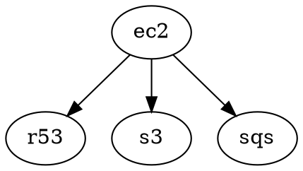

# config1

Base infrastructure configuration containing shared resources: EC2, Route53, S3, and SQS.
The EC2 module depends on the other three resources.
Uses S3-based backend for state management (e.g., [s3](https://github.com/truszkowski/terragrunt-examples/blob/b6758b7e390a619227fa2593b53aec7d032b374b/multi/config1/s3/terragrunt.hcl#L5))

Settings:
- source code: `terragrunt-examples`
- branch: `main`
- project root: `multi/config1`
- vendor: terragrunt `v0.89.0`, open tofu `1.10.8`, run-all=`true`
- integration: AWS (for remote state backend - s3)

## dependency graph



No external dependencies. Nothing funny here.

## resources view

Resources are prefixed by module name:
```
sqs/pet random_pet
sqs/sqs output
s3/pet random_pet
s3/s3 output
r53/pet random_pet
r53/r53 output
ec2/pet random_pet
ec2/sqs output
ec2/s3 output
ec2/r53 output
ec2/ec2 output
```