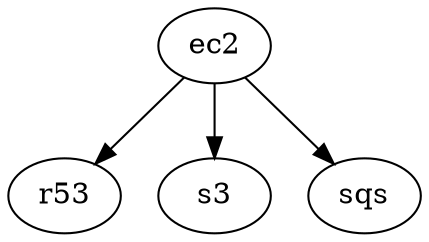

# config1

Base infrastructure configuration containing shared resources: EC2, Route53, S3, and SQS.
The EC2 module depends on the other three resources.
Uses S3-based backend for state management (e.g., [s3](https://github.com/truszkowski/terragrunt-examples/blob/b6758b7e390a619227fa2593b53aec7d032b374b/multi/config1/s3/terragrunt.hcl#L5))

## dependency graph

No external dependencies.