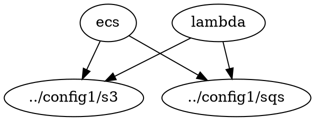

# config2

Extended configuration with ECS and Lambda services that utilize S3 and SQS resources from config1.
Demonstrates resource sharing between configurations through external dependencies.
Uses S3-based backend for state management (e.g., [ecs](https://github.com/truszkowski/terragrunt-examples/blob/b6758b7e390a619227fa2593b53aec7d032b374b/multi/config2/ecs/terragrunt.hcl#L24))

## dependency graph



External dependencies on `s3` and `sqs`.

## run in spacelift

Recent terragrunt versions exclude external dependencies by default. 

`v0.99.1`:
```
09:30:14.162 INFO   Unit queue will be processed for plan in this order:
- Unit ecs
- Unit lambda
...
❯❯ Run Summary  2 units  2s
   ────────────────────────────
   Succeeded    2
```

`v0.89.0` (with `$TG_QUEUE_EXCLUDE_EXTERNAL=true`):
```
10:05:48.493 INFO   The runner-pool runner at . will be processed in the following order for command plan:
- Unit ./ecs
- Unit ./lambda
...
❯❯ Run Summary  4 units  5s
   ────────────────────────────
   Succeeded    2
   Excluded     2
```

In Spacelift, we check run show commands to detect changes and gather resources for display in the resources view. Since v0.89.0, we use report files to detect which module is excluded or not:
```
[01KH5R5BSZZBAZGC5MKAVFZ584] Show report: name=/mnt/workspace/source/multi/config1/sqs result="excluded" reason="--queue-exclude-external" (bytes=0)
[01KH5R5BSZZBAZGC5MKAVFZ584] Show report: name=ecs result="succeeded" (bytes=568)
[01KH5R5BSZZBAZGC5MKAVFZ584] Show report: name=lambda result="succeeded" (bytes=573)
[01KH5R5BSZZBAZGC5MKAVFZ584] Show report: name=/mnt/workspace/source/multi/config1/s3 result="excluded" reason="--queue-exclude-external" (bytes=0)
...
[01KH5R5BSZZBAZGC5MKAVFZ584] Excluding module /mnt/workspace/source/multi/config1/s3 from run-all - exclude configuration block has been evaluated to true
[01KH5R5BSZZBAZGC5MKAVFZ584] Excluding module /mnt/workspace/source/multi/config1/sqs from run-all - exclude configuration block has been evaluated to true
...
```