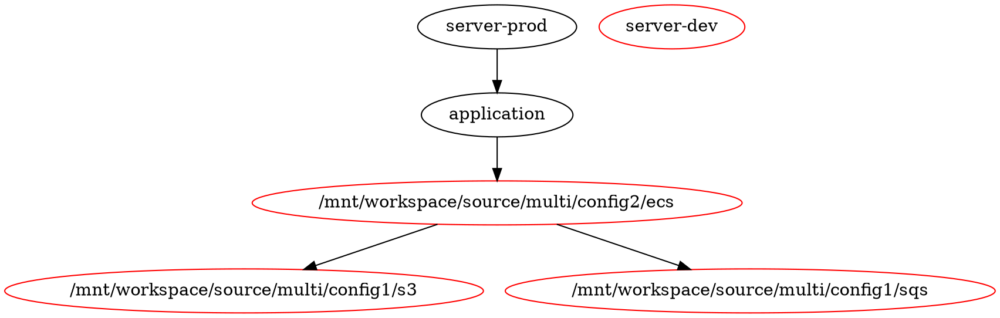

# config3

Multi-level dependency configuration demonstrating transitive dependencies across config1 and config2.
Application module depends on ECS from config2, which in turn depends on S3 and SQS from config1.
Server environments (dev/prod) depend on the application module.
Uses S3-based backend for state management.

## dependency graph



## run in spacelift

In Spacelift, let's use `v0.89.0` with `$TG_QUEUE_EXCLUDE_EXTERNAL=true` and `$TG_QUEUE_EXCLUDE_DIR=server-dev`:
```
10:32:12.022 INFO   The runner-pool runner at . will be processed in the following order for command plan:
- Unit ./application
- Unit ./server-prod
...
❯❯ Run Summary  6 units  5s
   ────────────────────────────
   Succeeded    2
   Excluded     4
```

We know from report what modules are skipped:
```
[01KH4N7APAR7HQEGWGDGF1NDZP] Show report: name=/mnt/workspace/source/multi/config1/s3 result="excluded" reason="--queue-exclude-external" (bytes=0)
[01KH4N7APAR7HQEGWGDGF1NDZP] Show report: name=/mnt/workspace/source/multi/config1/sqs result="excluded" reason="--queue-exclude-external" (bytes=0)
[01KH4N7APAR7HQEGWGDGF1NDZP] Show report: name=/mnt/workspace/source/multi/config2/ecs result="excluded" reason="--queue-exclude-external" (bytes=0)
[01KH4N7APAR7HQEGWGDGF1NDZP] Show report: name=application result="succeeded" (bytes=2304)
[01KH4N7APAR7HQEGWGDGF1NDZP] Show report: name=server-prod result="succeeded" (bytes=2362)
[01KH4N7APAR7HQEGWGDGF1NDZP] Show report: name=server-dev result="excluded" reason="--queue-exclude-dir" (bytes=0)
```